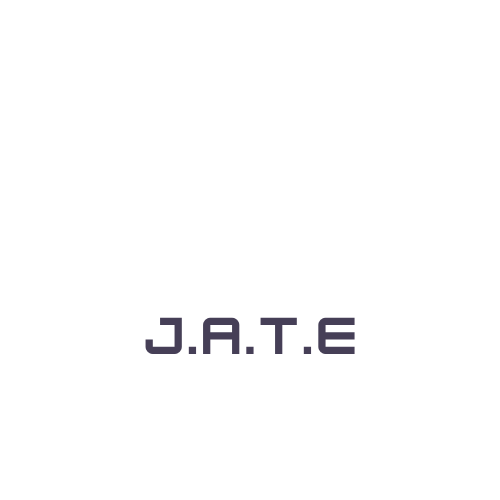

# JATE - Just Another Text Editor

JATE (Just Another Text Editor) is a Progressive Web Application (PWA) that allows users to create and edit text content seamlessly, with or without an internet connection. Built using modern technologies including webpack, service workers, and IndexedDB, JATE offers a reliable and efficient text editing experience for developers.

## Features

- **Offline Editing**: Create and edit text content even when offline, with changes automatically synced when online.
- **IndexedDB Integration**: Utilizes IndexedDB for local storage, ensuring content persistence across sessions.
- **PWA Compatibility**: Works as a Progressive Web App, allowing users to install the application on their devices for easy access.
- **Webpack Integration**: Bundles JavaScript files using webpack, optimizing performance and resource management.
- **Service Worker**: Includes a service worker for caching static assets, providing faster loading times and offline accessibility.
- **Customizable**: Easily customize the text editor to suit your preferences with various plugins and themes.

## Installation

To run JATE on a local server, follow these steps:

1. Clone the repository: `git clone https://github.com/LorenzoRiosWeb/Text-Editor`
2. Navigate to the project directory: `cd Text-Editor`
3. Install dependencies: `npm install`
4. Run the build and start the server: `npm run start`

## Known Issues

- Installation process may encounter difficulties on certain configurations. If you encounter any issues, please refer to the troubleshooting section in the documentation.

## Contributing

Contributions are welcome! Feel free to submit bug reports, feature requests, or pull requests to help improve JATE.

## License

This project is licensed under the MIT License - see the [LICENSE](LICENSE) file for details.

---

JATE is a powerful and versatile text editor designed to enhance your productivity and streamline your workflow. Experience the convenience of offline editing and seamless synchronization with JATE.
